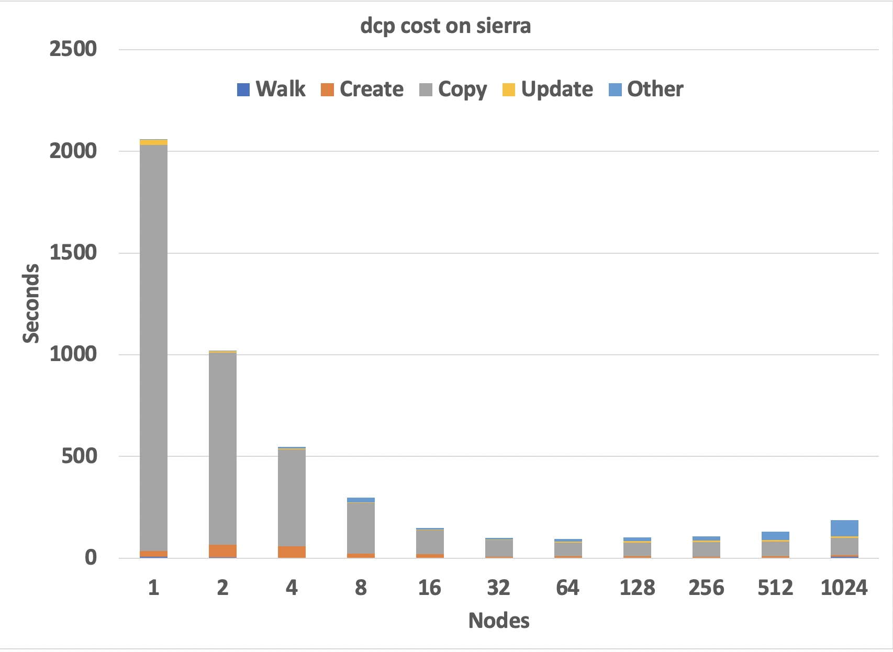

.. mpiFileUtils documentation master file, created by
   sphinx-quickstart on Fri Apr 13 11:47:51 2018.
   You can adapt this file completely to your liking, but it should at least
   contain the root `toctree` directive.

================
**mpiFileUtils**
================

Overview
*************

High-performance computing users generate large datasets using parallel applications that can run with thousands of processes.
However, users are often stuck managing those datasets using traditional single-process tools like cp and rm.
This mismatch in scale makes it impractical for users to work with their data.

The mpiFileUtils suite solves this problem by offering MPI-based tools for basic tasks like copy, remove, and compare for such datasets,
delivering orders of magnitude in performance speedup over their single-process counterparts.
Furthermore, the libmfu library packages common functionality to simplify the creation of new tools,
and it can even be invoked directly from within HPC applications.

Video Overview: `"Scalable Management of HPC Datasets with mpiFileUtils" <https://youtu.be/cxjPOUS-ZBY>`_, HPCKP'20.

The figure below, taken from the above presentation, illustrates the potential performance improvement that one can achieve
when scaling a tool like dcp to utilize more compute resources.

   dcp scaling performance on the Sierra cluster at LLNL using 40 processes/node.  Shows the time required to copy a single directory of 200k files totaling 24.4 TiB of data.  The minimum time of 93 seconds at 64 nodes is 495x faster than the 12.75 hours taken by the cp command.

User Guide
***************************

.. toctree::
   :maxdepth: 2

   build.rst
   proj-design.rst
   tools.rst
   libmfu.rst

